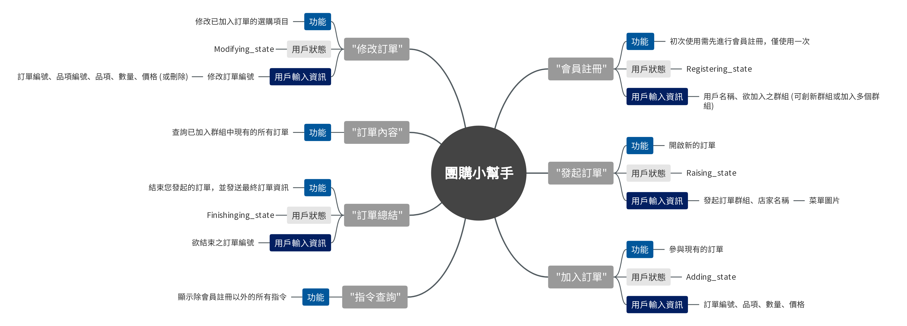

# 團購小幫手 Line Bot
## 概述
在實驗室或辦公室中，大家時常會找朋友一起訂購餐點或是團購商品，但揪團的人會需要幫大家統計數量或是傳閱菜單，就顯得麻煩也常發生錯誤。為了解決這樣的困境，通過大家普遍使用的社群軟體Line，設計一個可以統整團購訂單的聊天機器人，讓大家不會再因為怕麻煩而放棄團購！  

## 功能說明
總共有7個指令可以使用，分別的功能如下  
- 「註冊會員」：初次使用需先進行會員註冊，僅使用一次
- 「發起訂單」：開啟新的訂單
- 「加入訂單」：參與現有的訂單
- 「修改訂單」：修改已加入訂單的選購項目
- 「訂單內容」：查詢已加入群組中現有的所有訂單
- 「訂單總結」：結束您發起的訂單，並發送最終訂單資訊
- 「指令查詢」：顯示除會員註冊以外的所有指令

在用戶輸入指令後，系統會改變用戶狀態來決定如何處理指令所需動作，不同指令會要求用戶輸入對應資訊，可以根據提示訊息來進行輸入。  
 

以上的心智圖更好的呈現了不同指令對應的功能、狀態及所需資訊。   

## Line Bot 運作說明
用戶將訊息傳出後，會先經過Line平台接收資訊，再將處理過後的訊息發送給伺服器，因此需要使用webhook進行傳遞，必須符合HTTPS的格式。  
